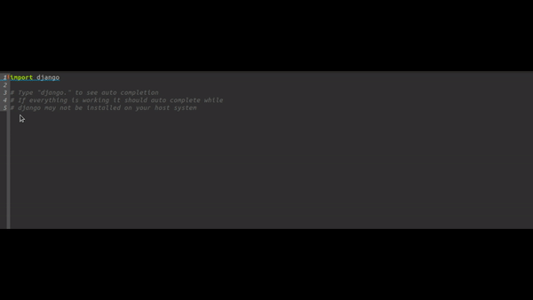

# pyls-docker-emacs-demo

This demo project shows a minimal example on how to achieve auto-completion in your editor by combining the following developer tools:

* [python-language-server](https://github.com/palantir/python-language-server)
* [GNU Emacs](https://www.gnu.org/software/emacs/)
* [eglot](https://github.com/joaotavora/eglot)
* [Docker](https://www.docker.com/)
* [docker-compose](https://docs.docker.com/compose/)

The principle that's demonstrated shows how to put the python language server in a container.
Once this is done the bash script in ``./cbin/pyls`` mimicks a non-containerized installation of the pyls application.
In reality it takes the input and output and it communicates with the process in the container.

Finally I've included a ``.dir-locals.el`` file which puts ``./cbin/pyls`` in the path of the Emacs editor.
This makes [eglot](https://github.com/joaotavora/eglot) auto complete using your python installation in the container.

I've also succesfully tested connecting to the pyls application in the container by setting the pyls path in Visual Code.
This trick can be applied to almost any editor and environment.

The patterns used in this demo project are succesfully applied in some larger projects to enable developers to make use of
auto-completion and auto-formatting of Python code.

Feel free to ask questions in case you also want to provide a similar environment to developers.

## After having the tools installed mentioned above and opening the script with eglot connected:

